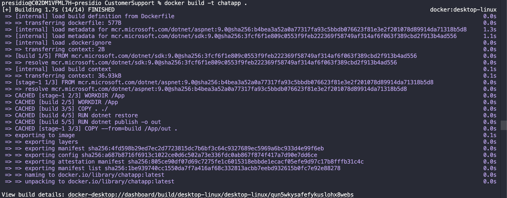
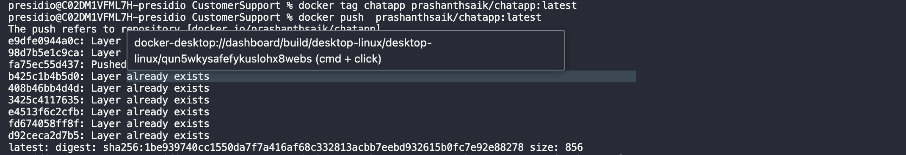
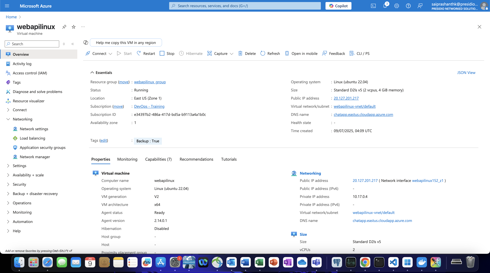
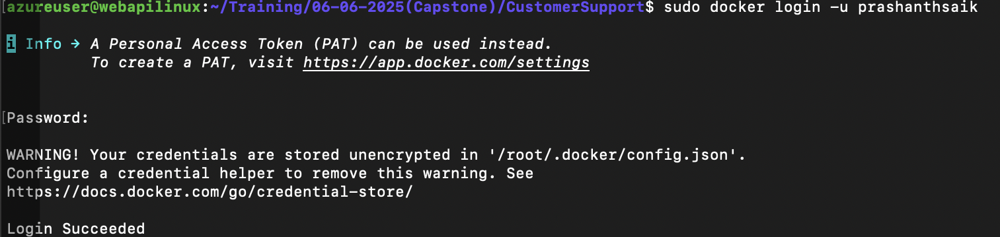
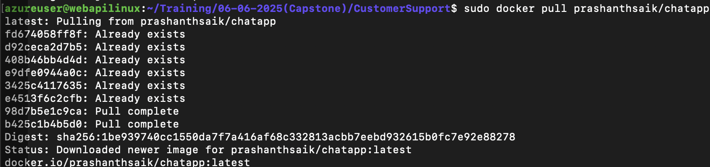
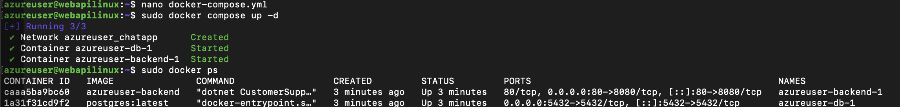
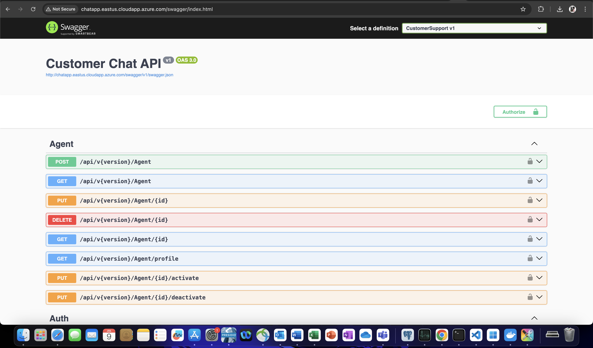
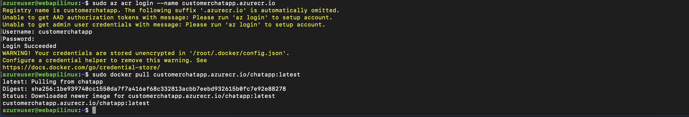

# Host an WebAPI Docker image in Azure VM

#### 📦 1. Build and Push Docker Image (Locally)

#### ☁️ 2. Create Azure Linux VM

#### 🐳 3. SSH Into the VM, Install Docker and Login to Docker and Pull Image

#### ▶️ 5. Run Docker Container

#### 🌐 6. View API in Browser

#### 🌐 Extras: Azure ACR

