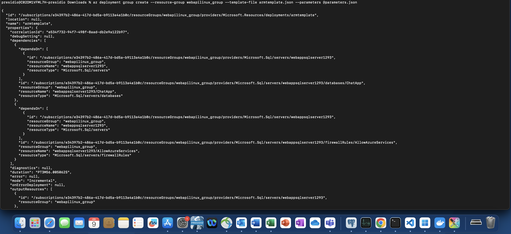
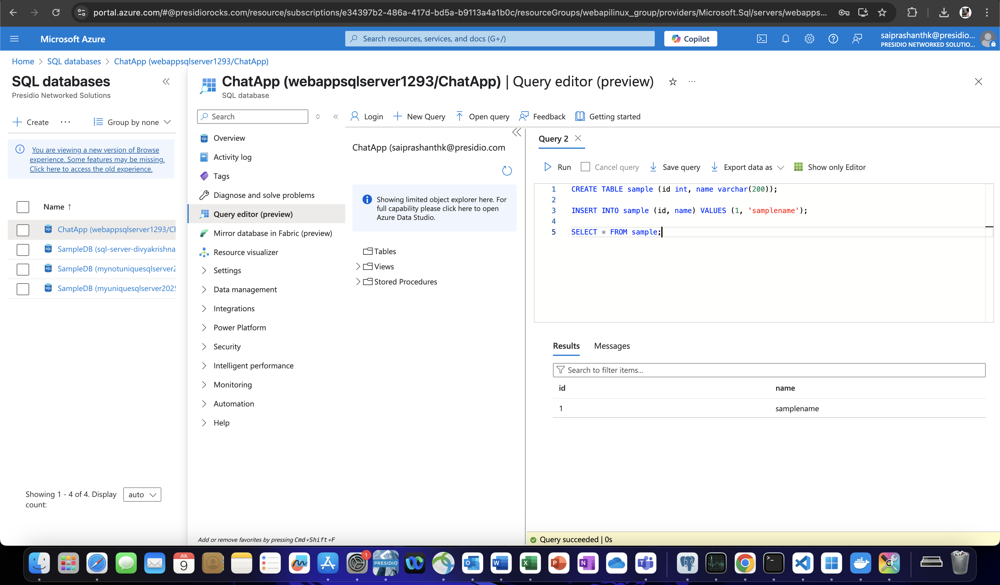

# Run an Azure SQL server using template file from CLI

#### 📄 1. Prepare template file and parameter file

#### 🚀 2. Execute the Command

```bash
az deployment group create --resource-group webapilinux_group --template-file armtemplate.json --parameters @parameters.json 
```



#### 🌐 Add Firewall rule to allow IP's and execute querys


