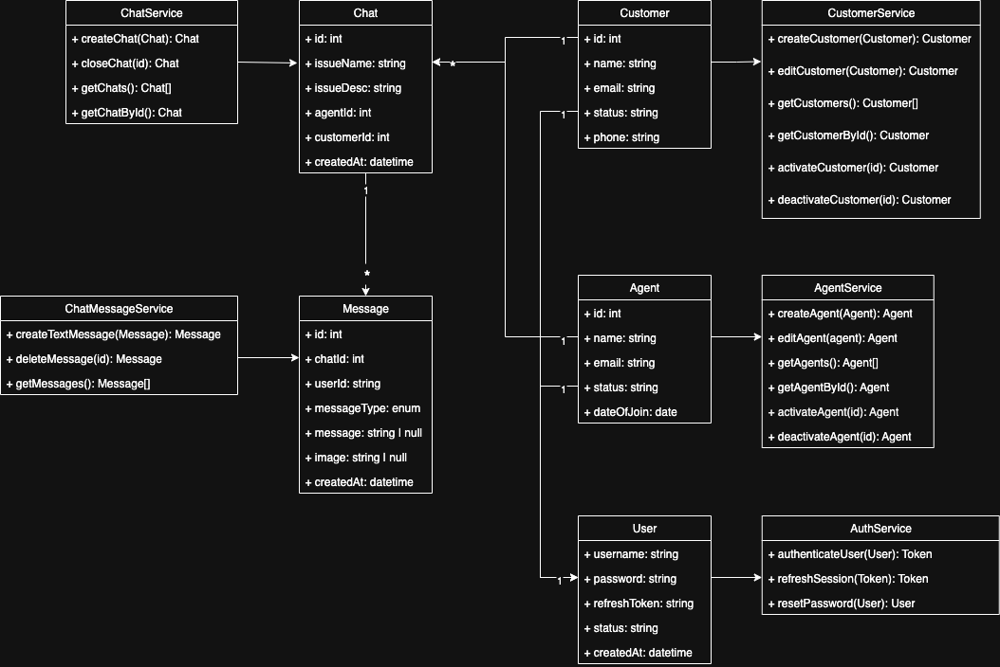
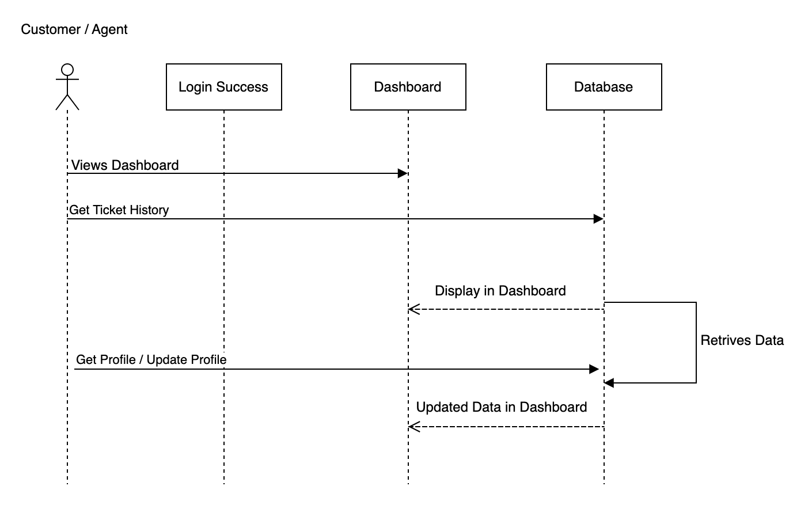
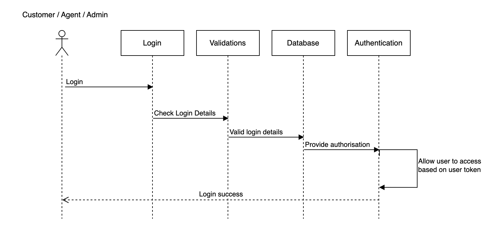
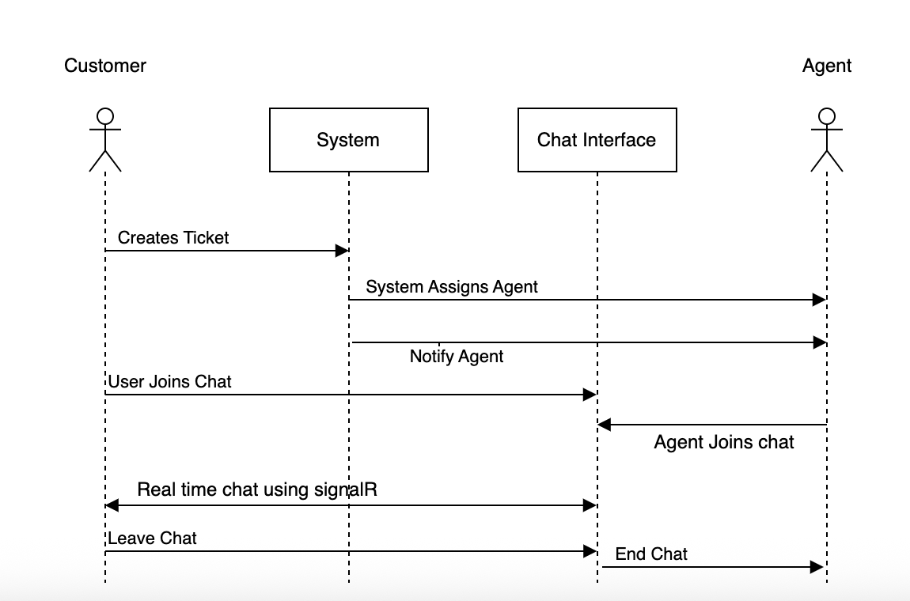
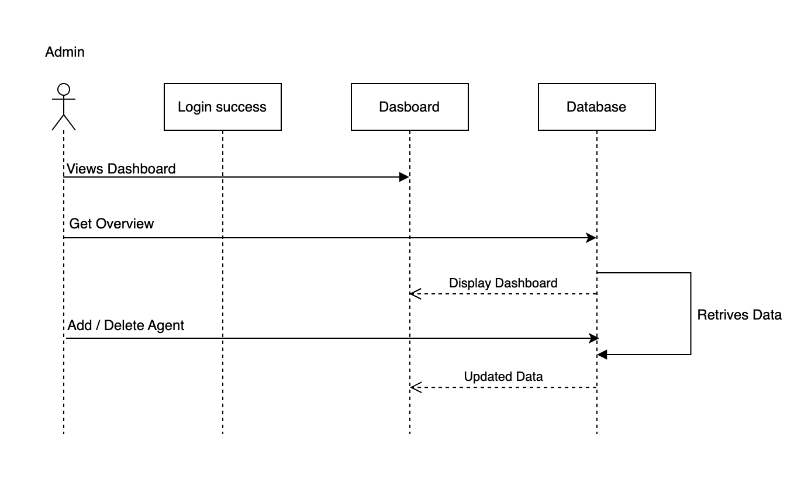
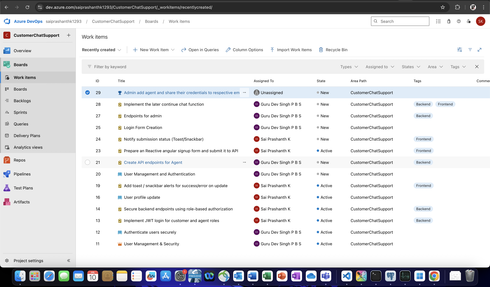
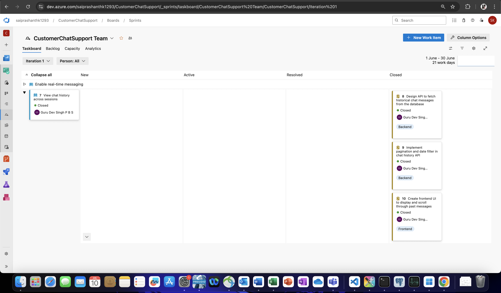
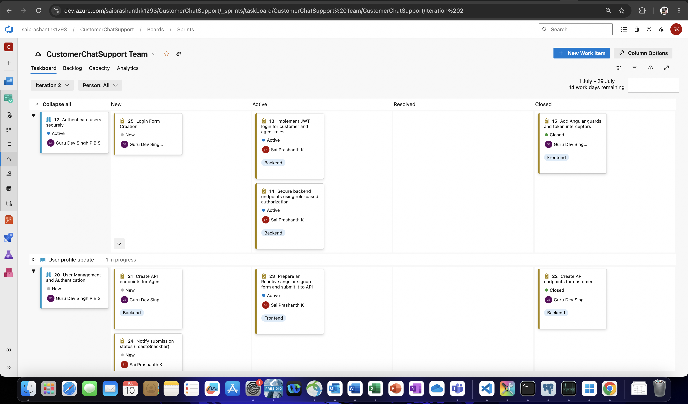
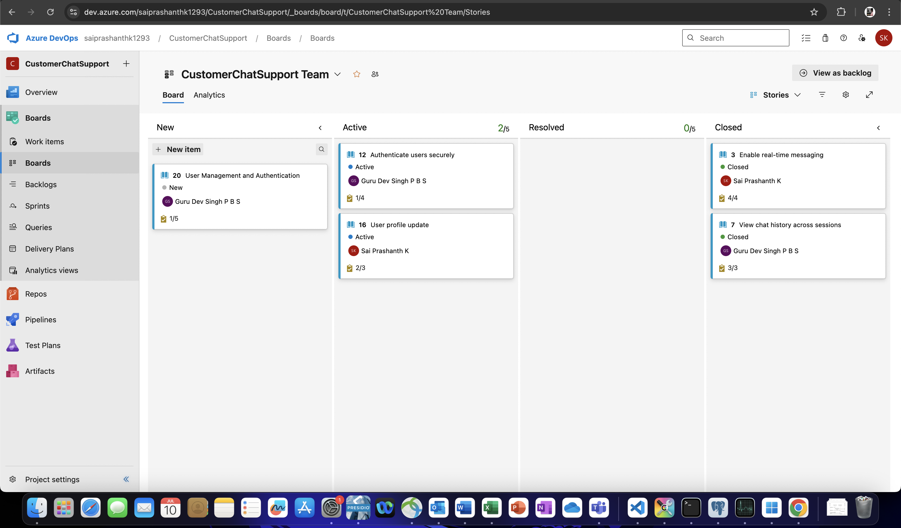

# 🧩 Customer Support Chat Application

This documentation provides a high-level overview of the system design for the **Customer Support Chat Application**, including UML diagrams and Azure Boards project management details.

---

## 📐 Class Diagram

The class diagram illustrates core components such as models and services, and how they interact.

> 📌 The diagram includes entities like `Customer`, `Agent`, `Chat`, `Message`, and services such as `ChatService`, `AuthService`, and `CustomerService`.

---

## 🔁 Sequence Diagrams

Sequence diagrams represent key interaction flows between system components.

### 🔐 User Authentication

---

### 👤 Customer/Agent Dashboard

---

### 💬 Customer Initiates Chat

---

### ⚙️ Admin Dashboard Interaction

---

## 🧱 Component Responsibilities

| Component         | Responsibility                                                  |
|------------------|------------------------------------------------------------------|
| `ChatService`     | Manages chat creation, retrieval, closure.                      |
| `CustomerService` | Handles customer registration, updates, and availability.       |
| `AgentService`    | Manages agent onboarding, assignment, and state.                |
| `AuthService`     | Performs authentication and JWT token issuance.                 |
| `Message`         | Represents messages, including image support.                   |

---

## 🌐 Architecture Highlights

- 🔄 **Real-time chat**: Implemented using SignalR.
- 🔒 **Authentication**: JWT with refresh token support.
- 🗂️ **Database**: PostgreSQL with EF Core.
- ⚙️ **Backend**: ASP.NET Core Web API.
- 💻 **Frontend**: Angular SPA with role-based components.

---

## 🚀 Azure Boards Project Tracking

The development process is managed using **Azure Boards** with organized Epics, User Stories, Tasks, and Iterations.

### 📊 Work Items Overview

---

### 🧭 Sprints and Iterations

- **Sprint 1**: Setup, Real-time Chat, Initial Chat UI
- **Sprint 2**: Authentication, Admin Panel, Notifications

📅 Duration: 1 month each

#### Sprint 1 :

#### Sprint 2 :

---

### 🧱 Kanban Board (Current Progress)

Active development visualized on the Kanban board:

✅ *Tasks moved to "Active" to reflect active work.*
