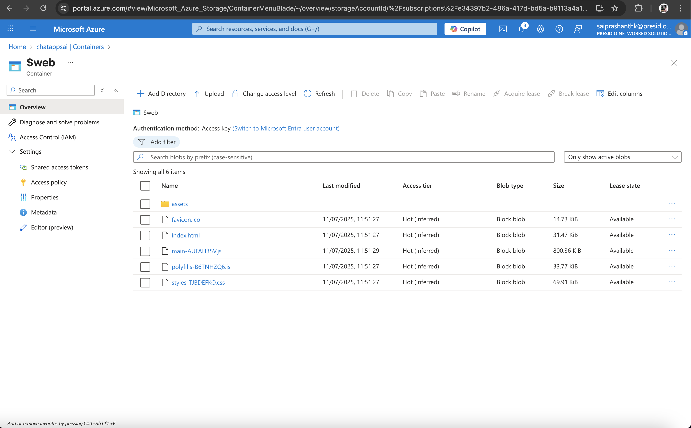

# ☁️ Azure Blob Storage Integration

This document explains how to integrate Azure Blob Storage with a .NET Web API and Angular static web app. It covers file upload/download, logging with Serilog, and hybrid storage for image files in a customer chat application.

---

## 1️⃣ .NET Web API – Upload & Download Files to Azure Blob

This module provides endpoints to upload and download files securely via Azure Blob Storage.

### 🔧 Setup

- Create an Azure Storage Account
- Get your connection string from `Access Keys`
- Add it to `appsettings.json`:

```json
{
  "Azure": {
    "StorageConnectionString": "<your-storage-connection-string>"
  }
}
```

### 📦 Upload Logic

```csharp
var blobClient = _containerClient.GetBlobClient("new-image.jpg");
await blobClient.UploadAsync(file.OpenReadStream(), true);
```

### 📥 Download Logic with Base64

```csharp
var downloadInfo = await blobClient.DownloadStreamingAsync();
var image = downloadInfo.Value.Content;
var base64 = $"data:image/jpeg;base64,{Convert.ToBase64String(image)}";
```

### 📸 Screenshot


---

## 2️⃣ Host Angular Static App in Azure Blob Storage

You can host your Angular app directly in Azure using **Static Website** feature.

### 🔧 Steps

1. Build Angular app:  
   ```bash
   ng build --configuration=production
   ```

2. Enable Static Website in Azure Blob Storage:
   - Go to your Storage Account → "Static website"
   - Set:
     - Index document name: `index.html`
     - Error document path: `index.html` (important for Angular routes)

3. Upload `dist/<app-name>/Browser` contents into the `$web` container.

### 📸 Screenshot




---

## 3️⃣ Store Serilog Logs in Azure Blob Containers

Store logs generated from your .NET backend using `Serilog.Sinks.AzureBlobStorage`.

### 🧩 Serilog Setup


### 📸 Screenshot


---

## 4️⃣ Hybrid Image Storage in Customer Chat App

The application supports dual-storage of image files:

- 📁 Local file system (existing)
- ☁️ Azure Blob Storage (new)

### 📂 Created new service `ImageServiceBlob` and Injected


### 📸 Screenshot


---

### 🏷️ List of Containers 


