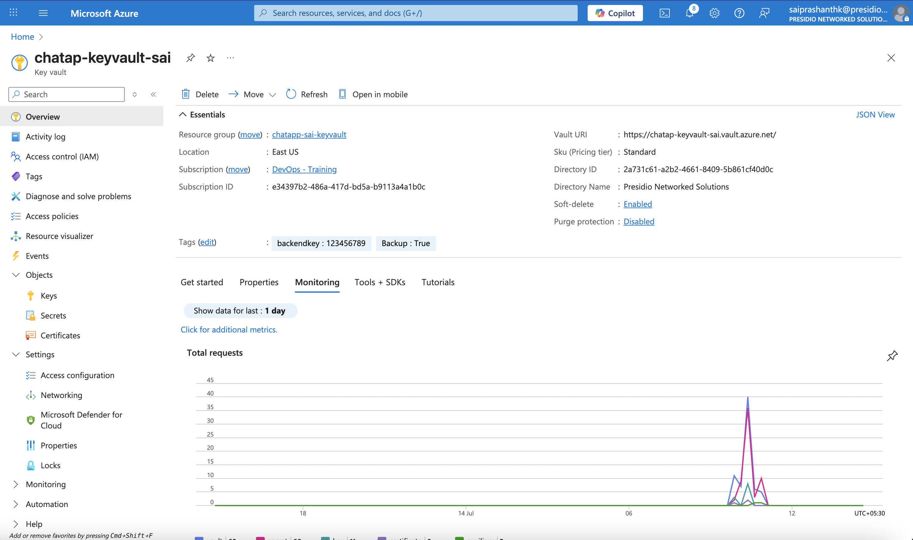
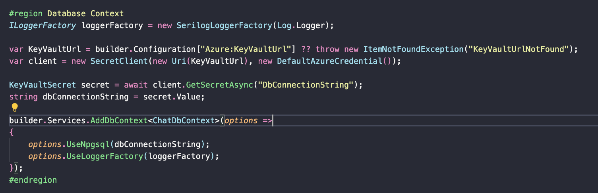
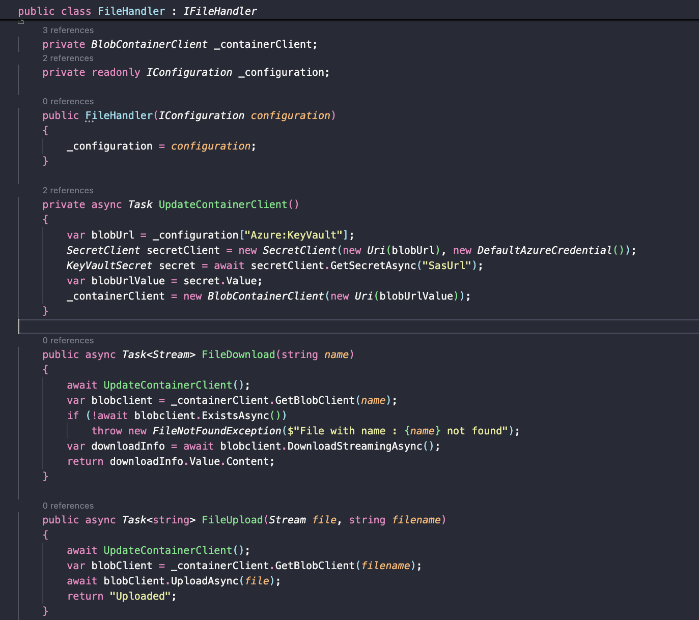
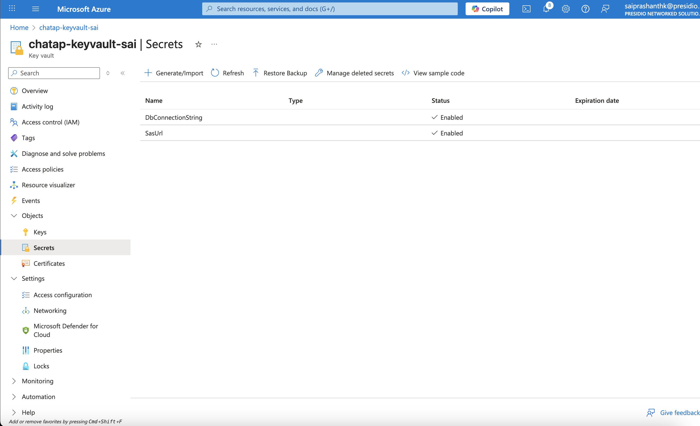
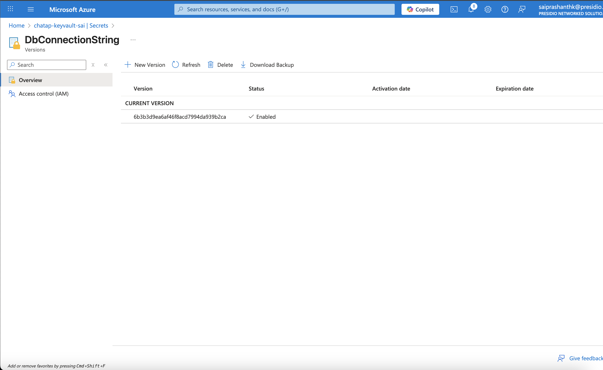
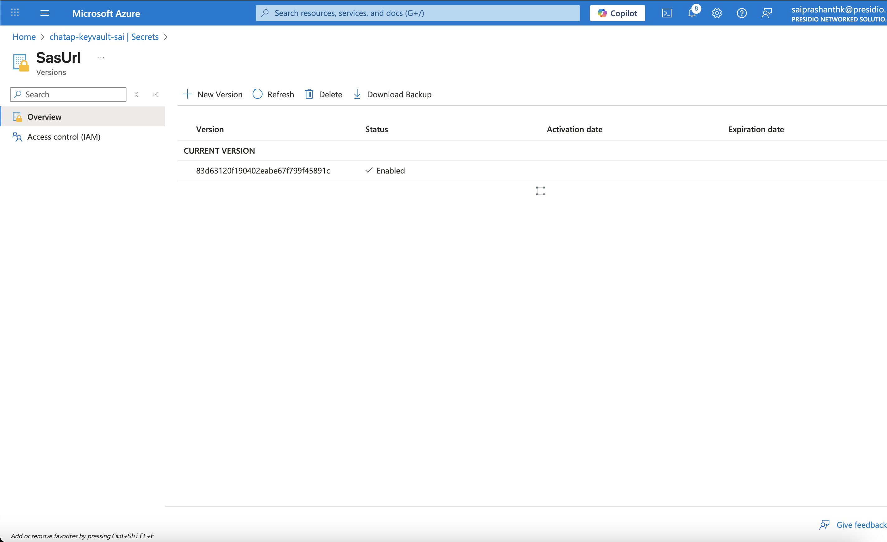
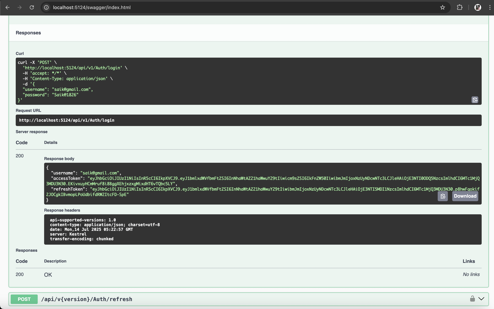
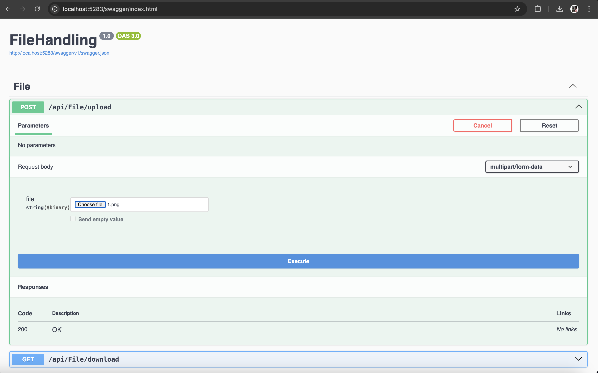
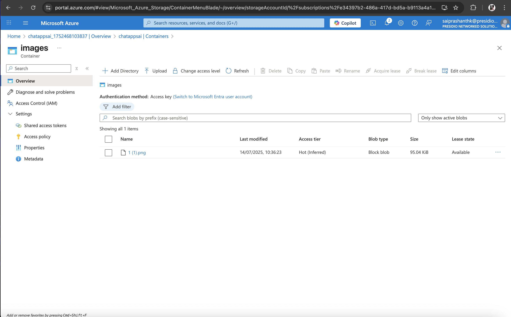

# 🔐 Azure Key Vault Integration in .NET

This guide explains how to securely store and access secrets like **Azure Blob Storage SAS URL** and **Database Connection Strings** from **Azure Key Vault** using a .NET Web API application.

---

## 🏗️ Create Key Vault and Secrets




## 🔧 Install NuGet Packages

```
dotnet add package Azure.Security.KeyVault.Secrets
dotnet add package Azure.Identity
```

## 🧠 Configure appsettings.json

```
{
  "Azure": {
    "KeyVault": "https://<KeyVaultName>.vault.azure.net/"
  }
}
```

## 🧑‍💻 Load Secrets from Key Vault in Program.




## 🖼️ Uploading to Azure Blob using SAS




## 🔑 Secrets in Azure Key Vault







## 📌 Output







