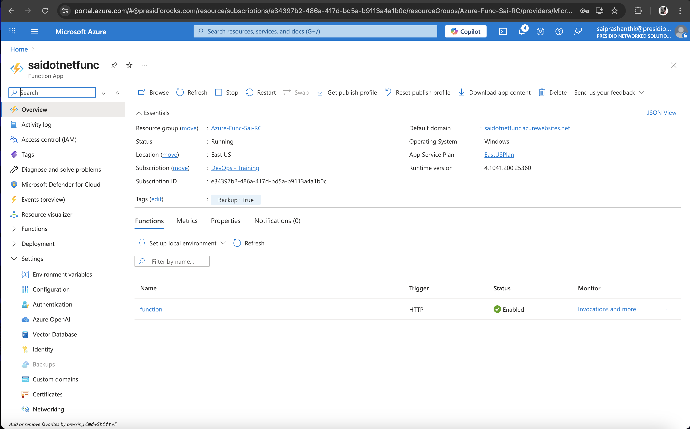
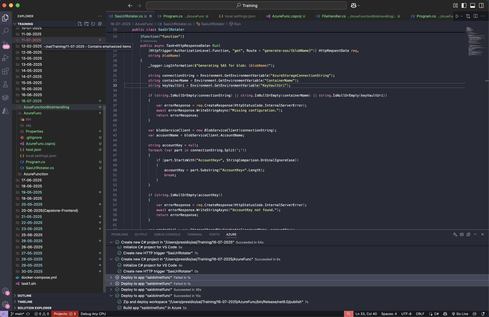
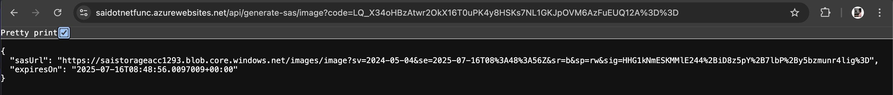
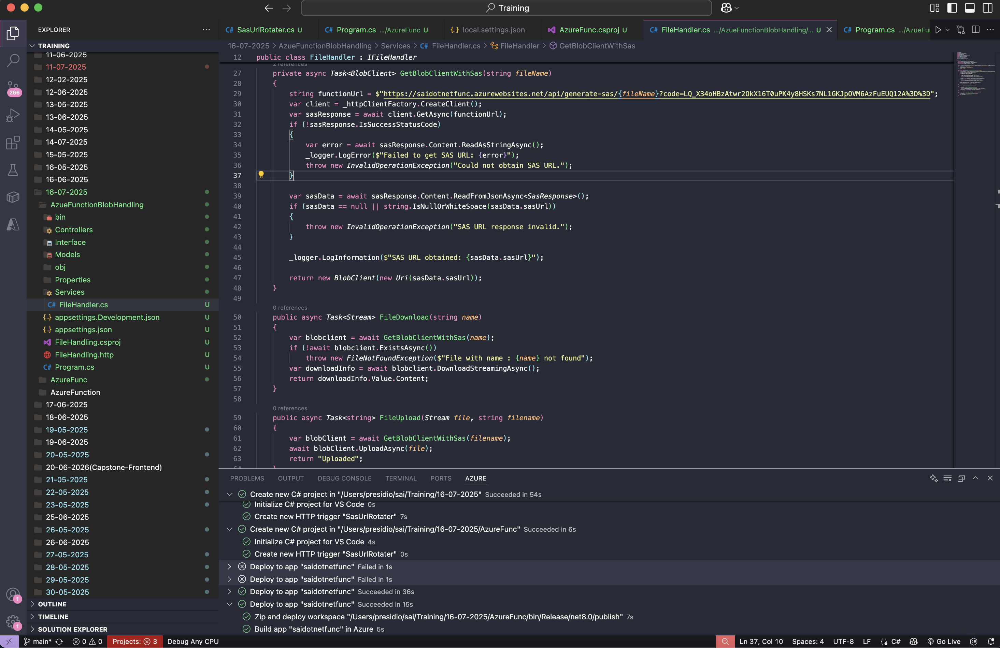
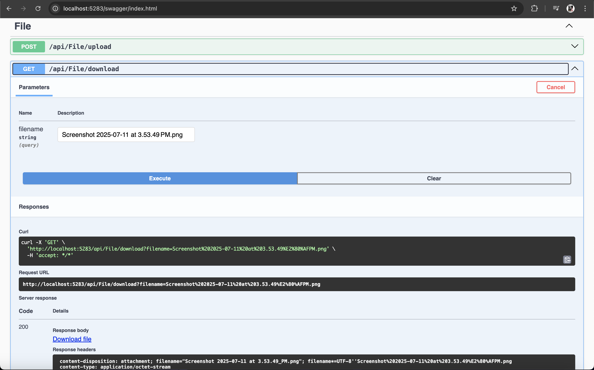
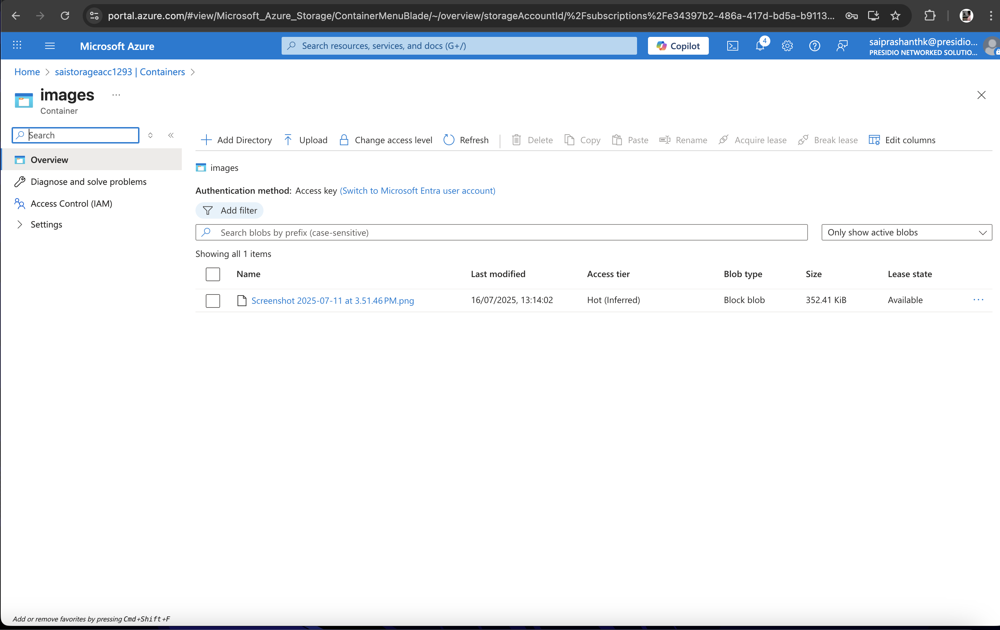

# Azure Function: Dynamic SAS URL Generation with Key Vault Integration

## 🧩 Objective

This project consists of:

- Creating a **.NET Azure Function** that:
  - Generates a **SAS URL** for a specified **blob in a container**.
  - Stores the SAS URL securely in **Azure Key Vault**.
  - Returns the **Key Vault Secret URL**.

- Integrating the Azure Function into a **file upload application** to:
  - Dynamically fetch the latest SAS URL at runtime.
  - **Upload** and **download** blobs **without worrying about SAS expiration** manually.

---

## 🚀 Azure Function

### ✨ Features

- Accepts a `blobName` via HTTP GET.
- Creates a SAS token for that blob (read/write).
- Stores the SAS URL in Azure Key Vault 
- Returns the **Key Vault Secret URL**.

### 🛠️ Create Azure Funtion 

```
az functionapp create --resource-group <resource-group-name> --consumption-plan-location eastus2 --name <funtion-name> --storage-account <storage-acc-name> --runtime dotnet-isolated --functions-version 4
```

#### 📂 Azure Funtion




### 🧾 Function Code




### 🚀 Deploy code to Azure Functions

#### ▶️  Build & Run

```
func start
```
#### ☁️ To deploy

```
func azure functionapp publish <YourFunctionAppName>
```

### 🔬 Test function




### 🔗 Integrate into BlobAPI



### 📁 Upload & Download ContainerFiles





