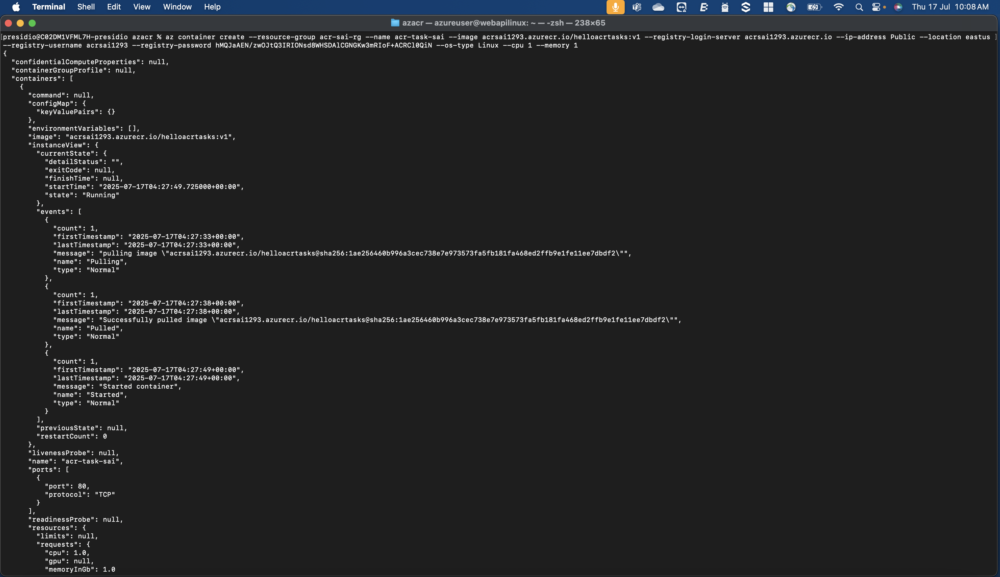

# 🚀 Azure ACR Workflow: Build, Push, and Deploy Container Image

Steps:

1. Creating an **Azure Container Registry (ACR)**
2. Building and pushing an image using `az acr build`
3. Tagging and pushing an image manually
4. Creating a container instance from the image
5. Exposing it publicly via IP

---

## 🔹 1. Create Azure Container Registry

## 🔹 2. Build and Push Docker Image Using az acr build

## 🔹 3. Manually Tag and Push Docker Image

## 🔹 4. Create Azure Container Instance from ACR Image

## 🌐 5. Access the Public IP

