# 🛠️ DevOps Tasks – Azure Deployment Guide
---

## ✅ Task 1: Host ASP.NET Core Application on Azure App Service

### Create Resource Group & Create App Service Plan

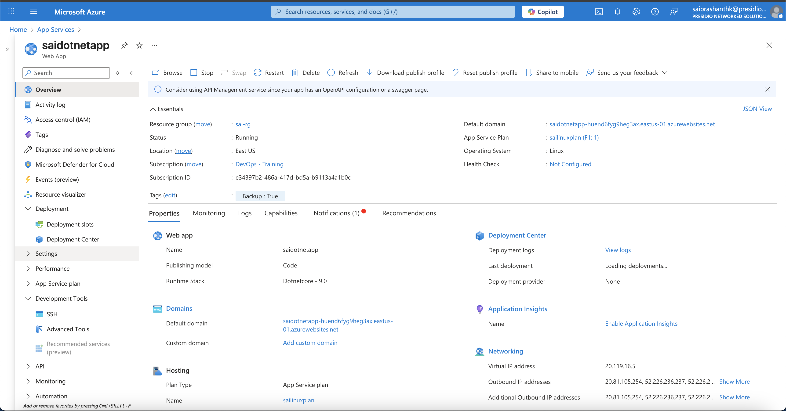

### Deploy from Local using Zip

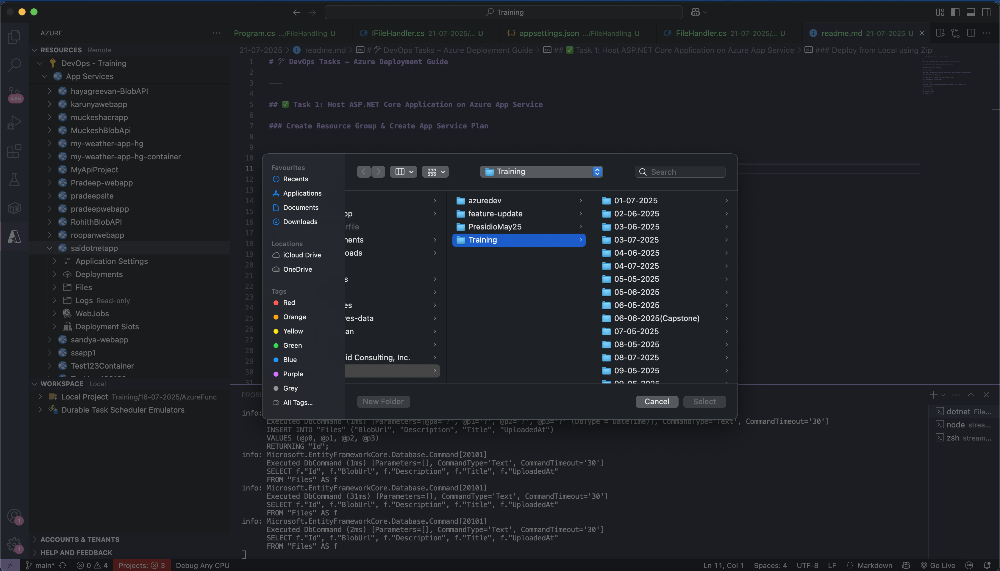

### Browse App

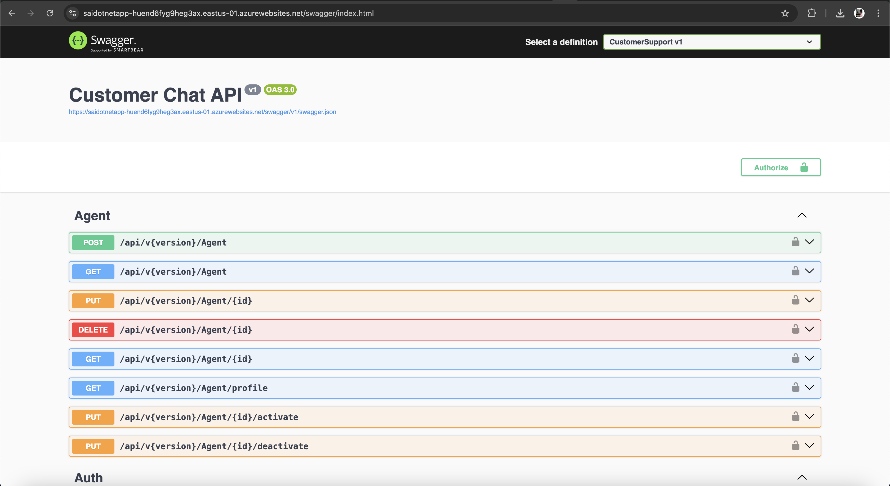

## ✅ Task 2: Create Azure Container Registry and Deploy Angular App via Container

### Create Container Registry

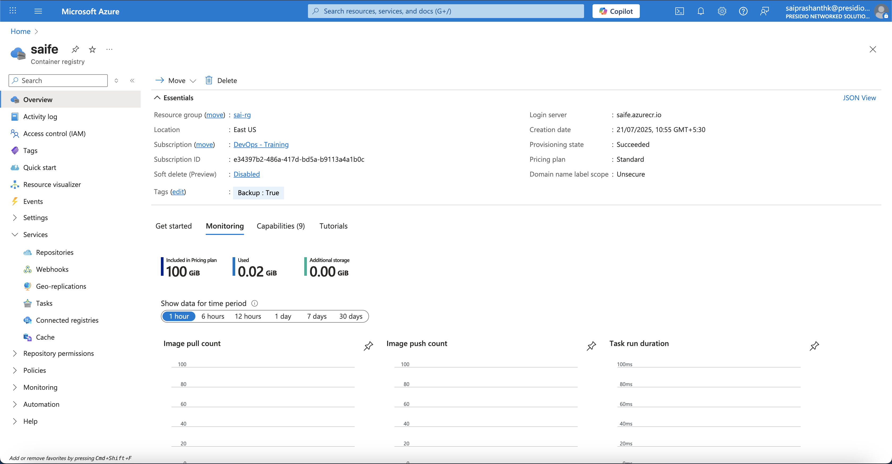

### Login to ACR & Tag and Push Angular Docker Image

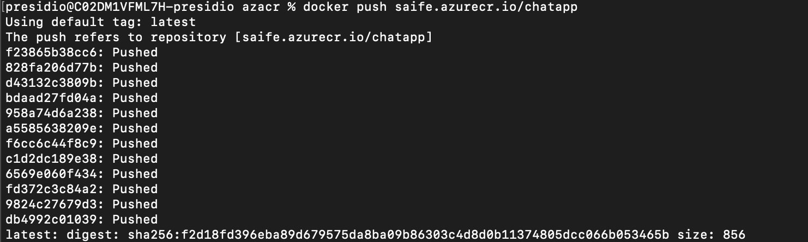

### Create Web App for Container

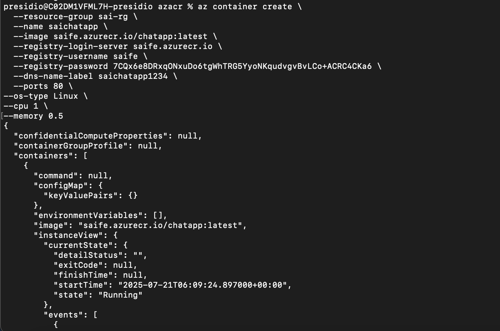

### Browse App

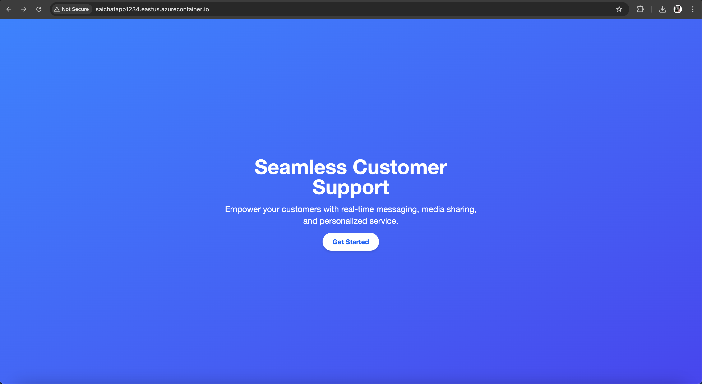

## ✅ Task 3: Video Upload & Streaming App using Azure Blob Storage + SAS

### Upload Form

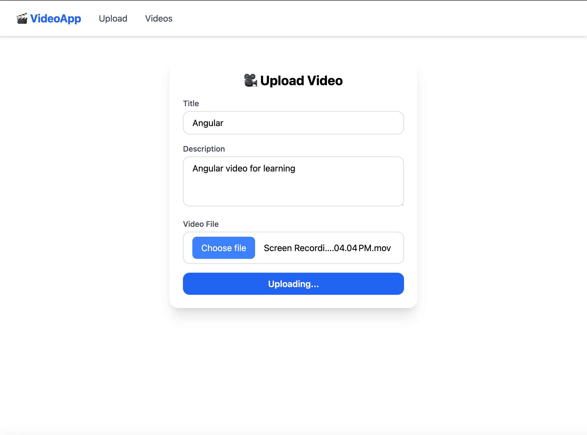

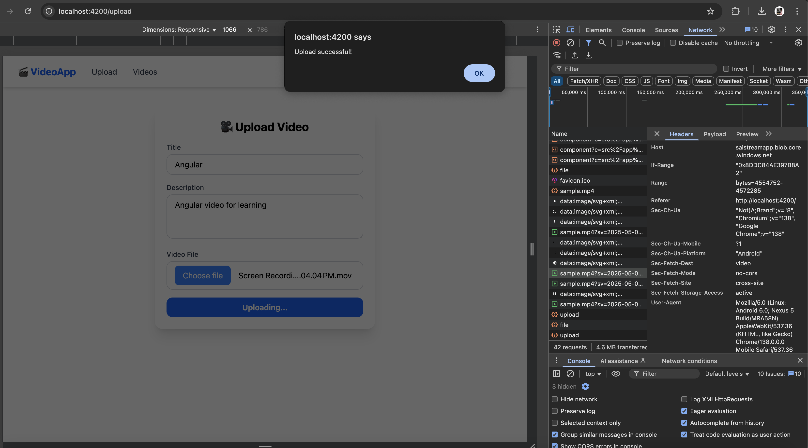

### List of videos

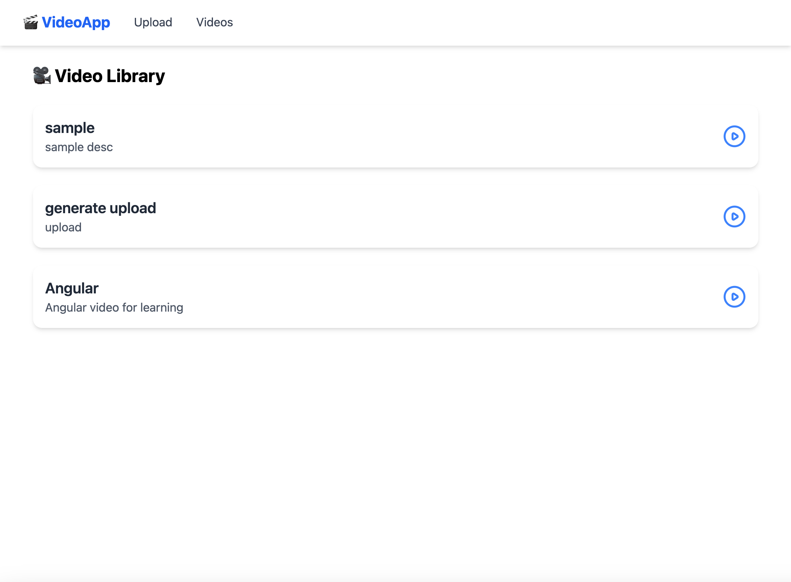

### Streaming Video

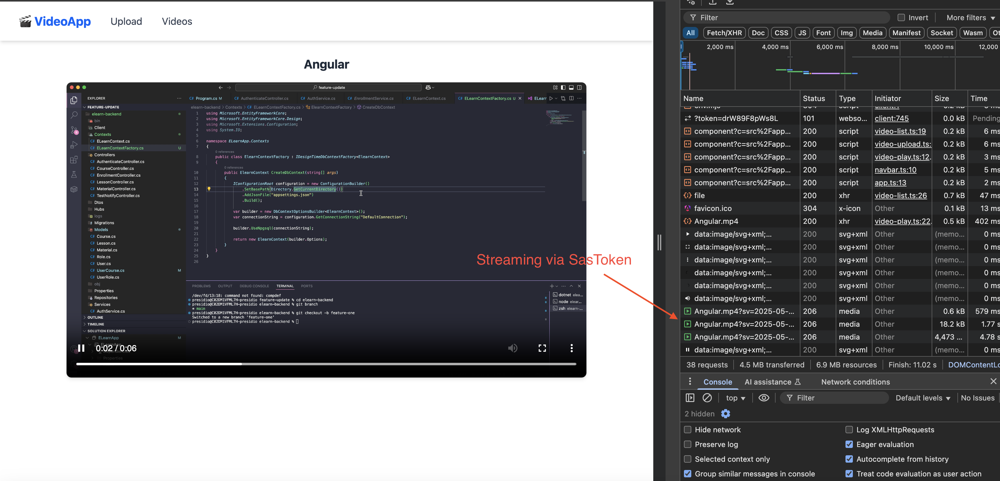

### API Endpoints

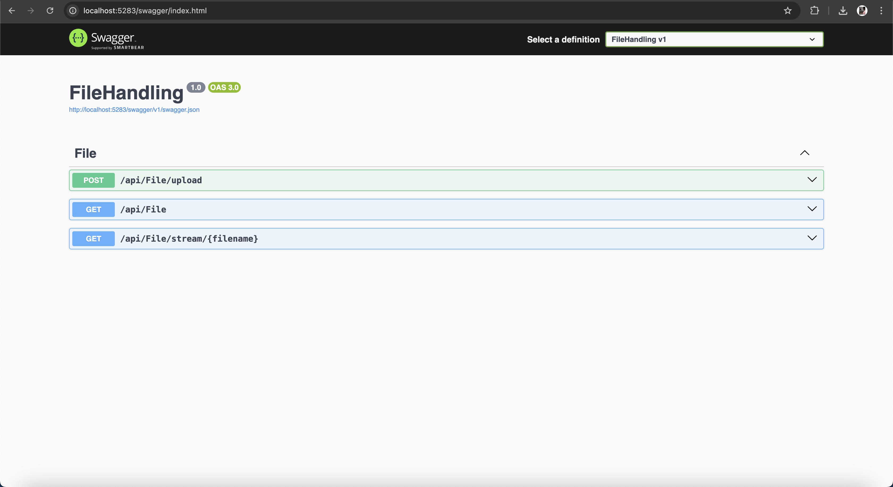

### Video Container

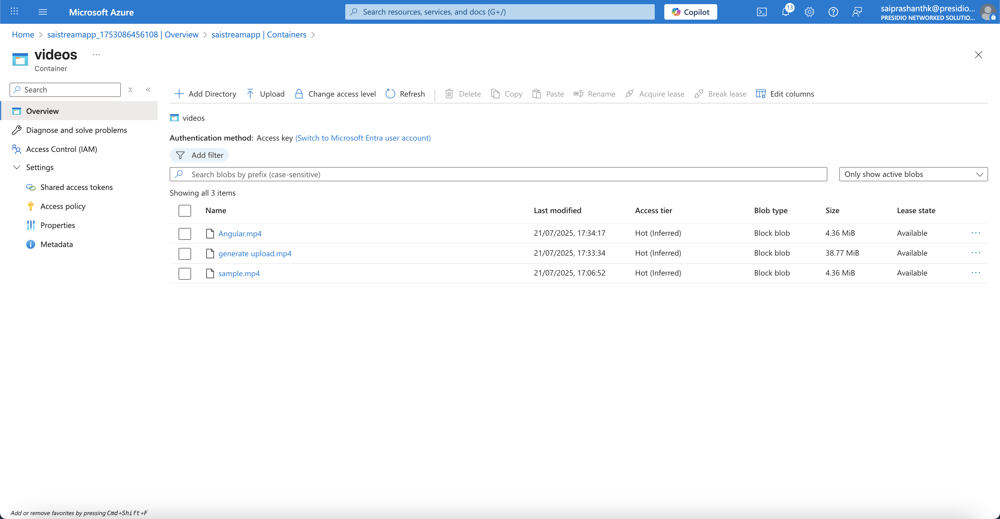