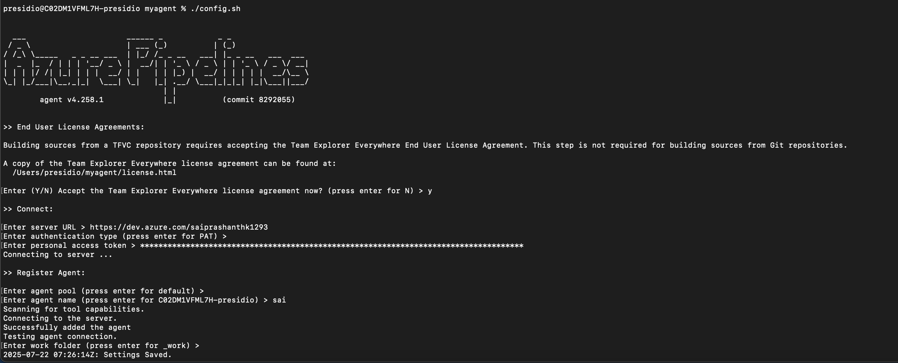
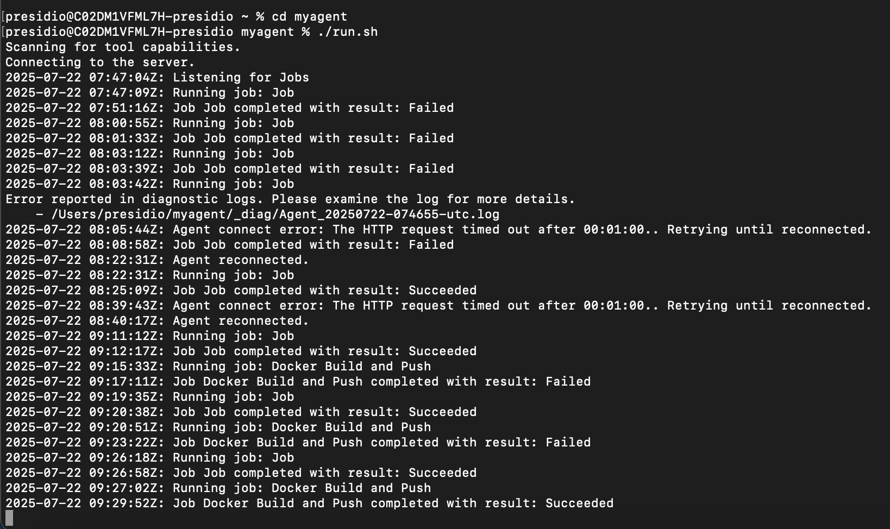
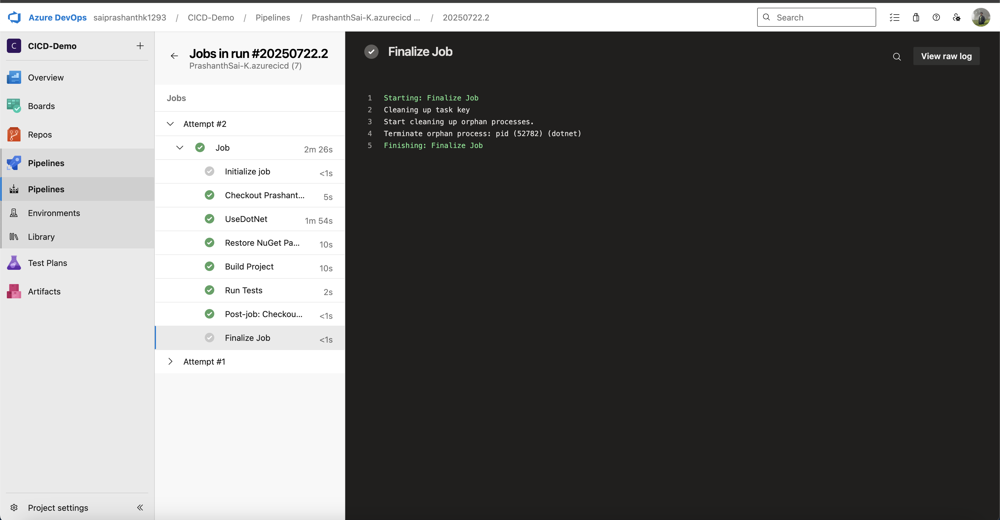
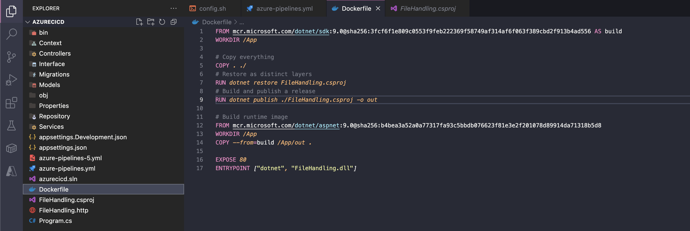
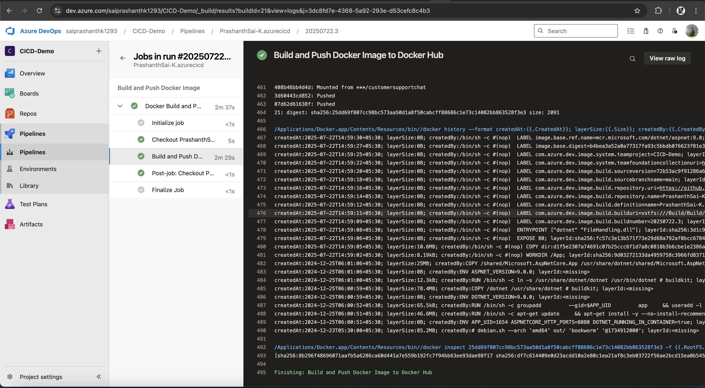
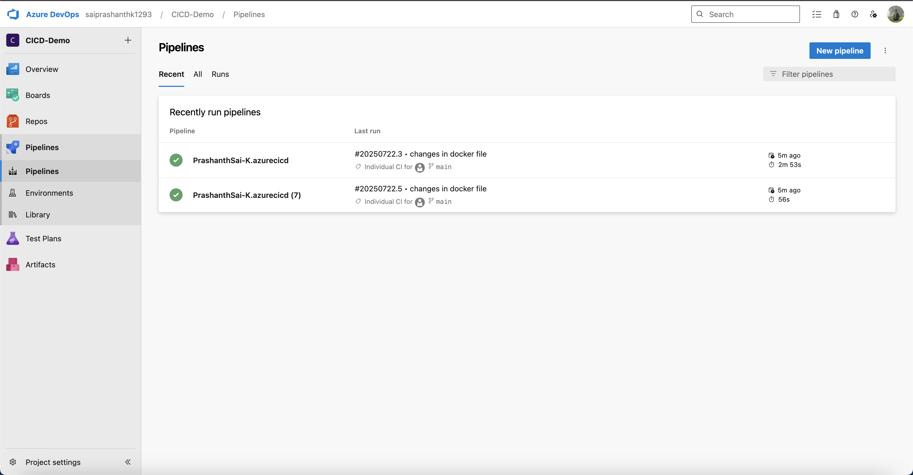
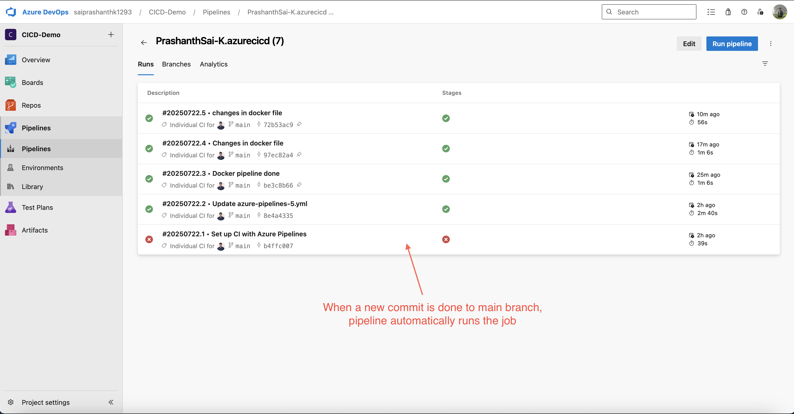
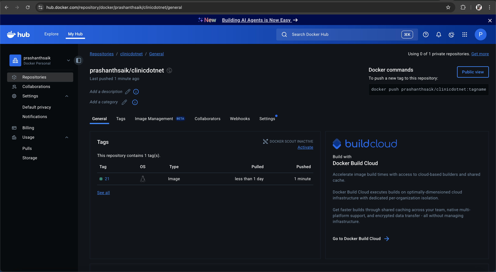

# 🚀 Azure Pipelines for .NET App Build & Docker Push

- 📦 **Pipeline 1**: Build and test a .NET project.
- 🐳 **Pipeline 2**: Build a Docker image of the .NET app and push it to Docker Hub.

## 🔨 Step 1: Create a Git Repository and Push Your .NET Project

> 

## 🔧 Step 2: Setup a Self-Hosted Azure Pipeline Agent

- Set up an self hosted agent in my local machine to run jobs because azure hosted agents are not free.

> 

> 

## ⚙️ Step 4: Setup Azure Pipeline to Build .NET App (Pipeline 1)

> 

## 🐳 Step 5: Write a Dockerfile

> 

## 🔁 Step 6: Setup Azure Pipeline to Build & Push Docker Image to Docker Hub (Pipeline 2)

> 

## 📌 Outputs

> 

> 

> 

